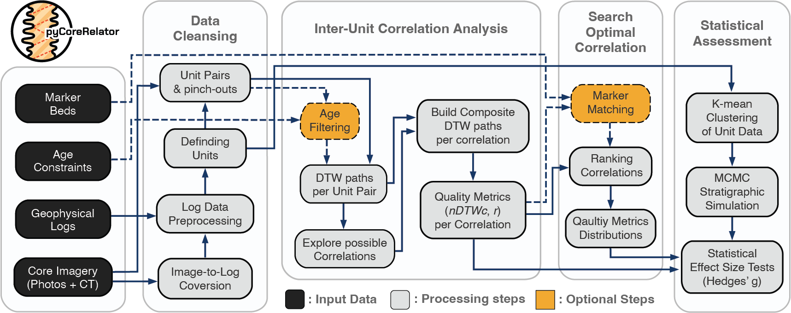
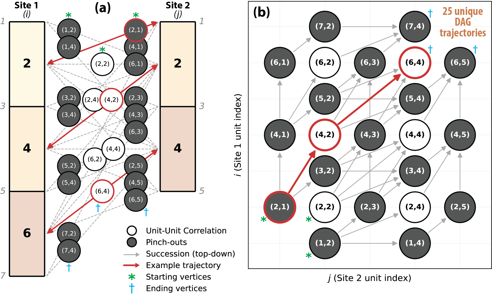
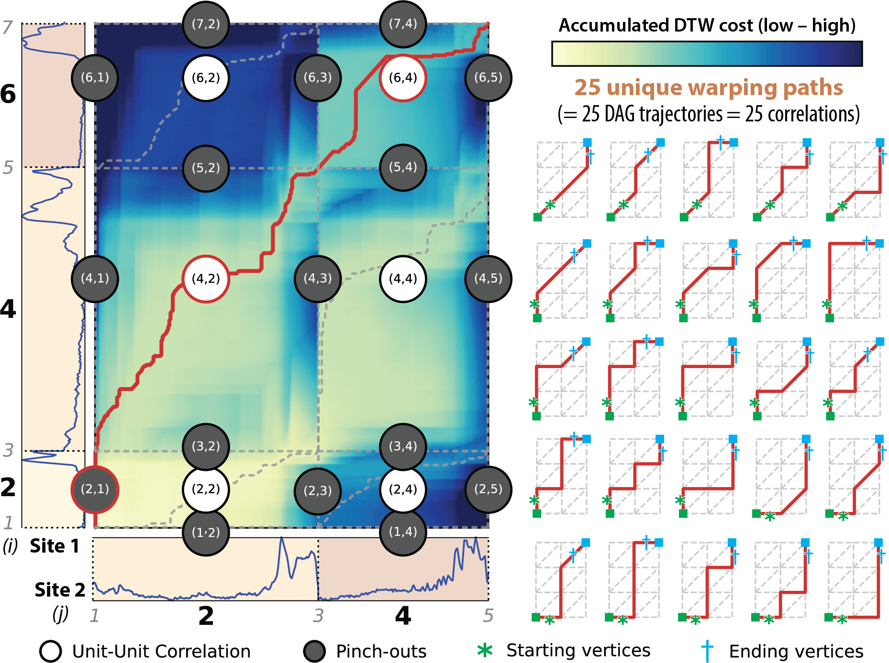
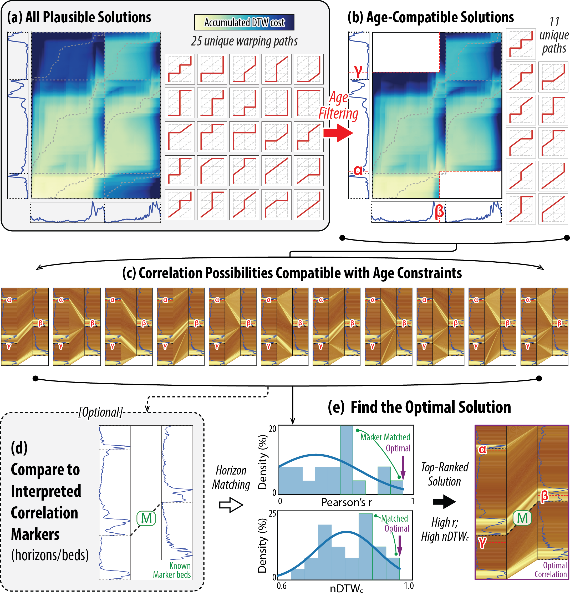
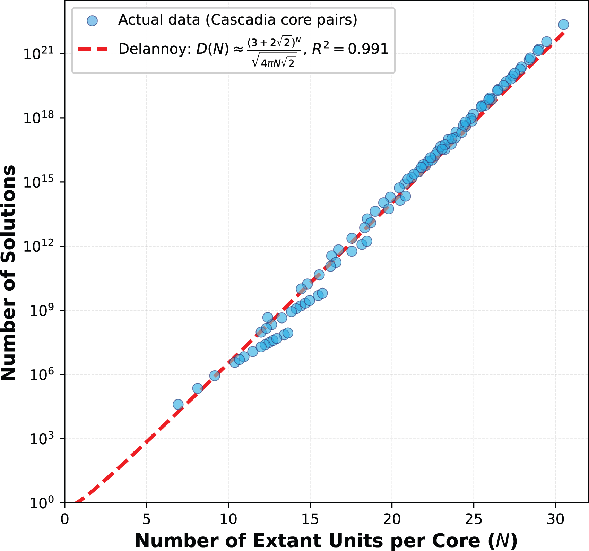
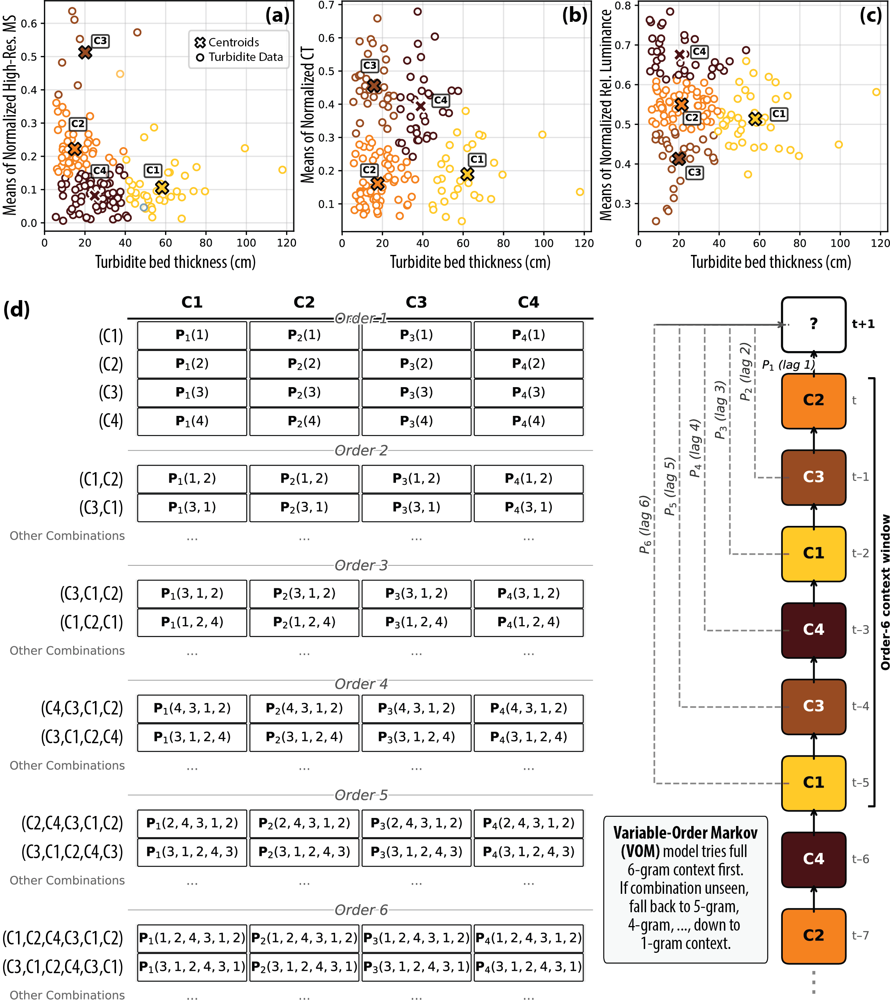
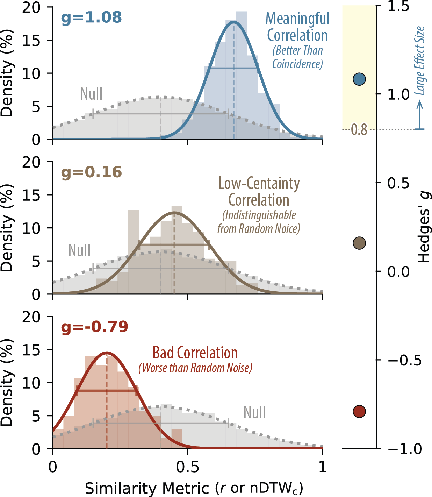

# pyCoreRelator
[](https://doi.org/10.5281/zenodo.17847259)  [](https://pypi.org/project/pycorerelator/) [](https://anaconda.org/conda-forge/pycorerelator) [](https://anaconda.org/conda-forge/pycorerelator) 

<div align="center">
  
</div>

**pyCoreRelator** is a Python package designed for quantitative stratigraphic correlation across geological core and physical log data. The package performs segment-based (i.e., unit-based or bed-to-bed) correlation analysis by applying Dynamic Time Warping (DTW) algorithms for automated signal alignment, while honoring fundamental stratigraphic principles (e.g., superposition, age succession, pinchouts). The main tool computes multiple measures for assessing correlation quality, under the assumption that higher signal similarity indicates stronger correlation. These quality metrics can also be used to identify optimal correlation solutions. In addition, the package provides utility functions for preprocessing log data (e.g., cleaning, gap filling) and core image data (e.g., image stitching, clipping, converting color profiles or scans into digital logs) for use in correlation assessment.

> [!WARNING]
> **pyCoreRelator** is currently under active development and has not yet been peer-reviewed. Please use with caution.

## Installation

### Requirements

- Python 3.9 to 3.13 (Python 3.14+ is not yet supported due to dependency constraints with numba/librosa)

### Install from PyPI

Users can install **pyCoreRelator** directly from [PyPI](https://pypi.org/project/pycorerelator/) with `pip` command:
```
pip install pycorerelator
```
or from `conda-forge` repository with `conda`:
```
conda install pycorerelator
```

**Note:** Python 3.14+ is currently not supported because some core dependencies (particularly `numba`, which is required by `librosa`) have not yet added support for Python 3.14. Please use Python 3.9-3.13 for installation.

## Citation

If you use the current pre-release of **pyCoreRelator** in your work, please cite:

Lai, L.S.-H. (2025) pyCoreRelator. *Zenodo*, https://doi.org/10.5281/zenodo.17847259

> [!NOTE]
> A manuscript describing the methodology and applications of **pyCoreRelator** is submitted and under peer-review.

For questions, feedback, or collaboration opportunities, please contact Larry Lai (larry.lai@beg.utexas.edu, larrysyuhenglai@gmail.com) or visit the [Quantitative Clastics Laboratory](https://qcl.beg.utexas.edu) at the Bureau of Economic Geology, The University of Texas at Austin.

## Key Features

<div align="center">
  
</div>

- **Segment-Based DTW Correlation**: Divide cores into analyzable segments using user-picked or machine-learning based (future feature) depth boundaries, enabling controls on the stratigraphic pinchouts or forced correlation datums
- **Interactive Core Datum Picking**: Manual stratigraphic boundary picking with real-time visualization, category-based classification, and CSV export for quality control
- **Age Constraints Integration**: Apply chronostratigraphic constraints to search the optimal correlation solutions
- **Quality Assessment**: Compute metrics for the quality of correlation and optimal solution search.
- **Complete DTW Path Finding**: Identify correlation DTW paths spanning entire cores from top to bottom
- **Null Hypothesis Testing**: Generate synthetic cores and test correlation significance with multi-parameter analysis. Synthetic stratigraphy supports **random** or **Markov Chain (MC)** segment selection; the MC approach uses **k-means clustering** of unit features to train transition models (see [FUNCTION_DOCUMENTATION.md](FUNCTION_DOCUMENTATION.md)).
- **Log Data Cleaning & Processing**: Convert core images (CT scans, RGB photos) to digital log data with capabilities of automated brightness/color profile extraction, image alignment & stitching
- **Machine Learning Data Imputation**: Advanced ML-based gap filling for core log data using ensemble methods (Random Forest, XGBoost, LightGBM) with configurable feature weighting and trend constraints
- **Multi-dimensional Log Support**: Handle multiple log types (MS, CT, RGB, density) simultaneously with dependent or independent multidimensional DTW approach
- **Visualizations**: DTW cost matrix and paths, segment-wise core correlations, animated sequences, and statistical analysis for the correlation solutions

## Correlation Quality Metrics

The package computes comprehensive quality indicators for each correlation with enhanced statistical analysis:

### Available Metrics
- **Correlation Coefficient**: [Default] Pearson's r between DTW aligned sequences
- **Normalized DTW Distance**:  [Default] Complimentary Normalized DTW cost (nDTWc) per alignment, which is the additive complement the normalized DTW cost at the end of warping path
- **DTW Warping Ratio**: DTW distance relative to Euclidean distance
- **DTW Warping Efficiency**: Efficiency measure combining DTW path length and alignment quality
- **Diagonality Percentage**: 100% = perfect diagonal alignment in the DTW matrix
- **Age Overlap Percentage**: Chronostratigraphic compatibility when age constraints applied

## Exploring Inter-Unit Correlations via Directed Acyclic Graph (DAG) 

<div align="center">
  
</div>

**pyCoreRelator** employs demonstrates Directed Acyclic Graph (DAG) in exploring inter-unit correlation possibilities. Above figure demonstrates an example indexing (i, j) for all available unit pairs between Site 1 (3 units) and Site 2 (2 units). **(a)** Even indices represent extant units, while odd indices denote phantom units (zero thickness) at where pinch-outs would occur. White cells indicate extant-to-extant correlations; gray cells indicate pinch-outs. **(b)** DAG representing all plausible correlation successions. The total number of available trajectories from the start to end vertices defines the set of valid correlations.


<div align="center">
  
</div>

Following above example, here I showcase how **pyCoreRelator** builds composite dynamic time wrapping (DTW) path for every inter-unit correlation possibility found through DAG. 
Circles are the same DAG vertex indices (i, j), corresponding gray dashed lines representing options of warping trajectories in the DTW cost matrix, where horizontal and vertical options are chosen when pinch-outs occur. Each red solid line portrays a unique composite warping path, corresponding to one DAG trajectory and a valid correlation among these units.


<div align="center">
  
</div>

Above figure shows **pyCoreRelator**'s strategy for finding optimal inter-unit correlations, following the same example aligning a 3-unit log with a 2-unit log. **(a)** All unique composite warping paths fround via integrated DAG and DTW approach. **(b)** Exclusion of warping paths incompatible with age constraints (⍺ < β < γ). **(c)** Visualization of age-valid correlations, where brighter colors indicate larger average aligned log values. **(d)** Comparison of algorithmic solutions against human-interpreted markers. **(e)** Identification of the optimal correlation using similarity metrics (Pearson's r, nDTWc) and its consensus with human interpretations


<div align="center">
  
</div>

The number of plausible inter-unit correlations can be estimated through the Delanny Number (D), based on the relationship the number of identified lithostratigraphic unit per core (N) and the number of geometrically plausible correlations (solution) among these units found by the DAG approach. Red dash line is prediction of the total number of solutions using the empirical formula of Delannoy number. Blue data points are actual results found during the pairwise correlation analysis for Cascadia turbidite cores ([Lai, 2026](https://doi.org/10.6084/m9.figshare.31884166)). 

**Note:** Dataset: Lai, L.S.-H. (2026) Analyzed core and log data of Cascadia Subduction Zone. figshare. https://doi.org/10.6084/m9.figshare.31884166.

## Statistical Evaluation for the Correlation Certainty  

While metrics like nDTWc and Pearson’s r objectively evaluate correlation quality, they serve only as relative comparisons within a specific geological setting. To distinguish genuine stratigraphic relationships from this natural background noise, I created a quantitative evaluation framework by comparing the observed the similarity metric distribution against a statistical benchmark based on stratigraphic emulation representing the null probability distribution of expected similarity between successions of similar lithofacies within the studied geological setting. The goal is to provide a conservative assessment of whether the observed pairwise correlations is geologically meaningful or simply a result of natural noise embedded in the environment.

The workflow begins by pooling segments of log sequences from individual units extracted from actual stratigraphic data in the study region. These pooled units are then classified into distinct facies groups via k-means clustering analysis. The algorithm automatically determines an ideal number of clusters that effectively partitions the data utilizing the standard Elbow Method paired with the Kneedle algorithm. Below figure **(a-c)** shows clustering results for Cascadia turbidite data ([Lai, 2026](https://doi.org/10.6084/m9.figshare.31884166)) using bed thickness against the means of normalized log data of high-resolution magnetic susceptibility (MS), computed tomography (CT) number, and relative luminance.


<div align="center">
  
</div>

**pyCoreRelator** then uses Variable-Order Markov model to define the occurrence probability of the next cluster based on the underlying stacking history and build transition probability matrices, tracking up to the sixth unit context below by default to augment a unit sampled from the stochastically selected cluster (see example in above figure **(d)**). During stratigraphic emulation, the software stacks the sequence until a target thickness or unit count is reached, explicitly ensuring that each unit data segment is only used once per synthesis. This single use constraint prevents distinctive beds from repeating and artificially inflating internal similarity. Furthermore, the software computes a stationary distribution via eigenvalue decomposition to represent the long term expected frequency of each cluster type, which is subsequently used to stochastically initialize the synthetic sequences. This method is used to generate abundant pairs of synthetic stratigraphic columns, and the full inter-correlation analysis and similarity metric computation pipeline performed on each pair. This process eventually generate representative baseline null distributions of each similarity metric.

<div align="center">
  
</div>

By benchmarking the similarity measures from real-data correlations against these null models of expected background heterogeneity, users can evaluate whether interpreted correlations are truly unique or merely consequences of shared lithological signatures. Conceptually, if the real-data probability distribution of a similarity metric (colored in above figure) is statistically distinguishable and significantly greater (Hedges' g ≥ 0.8) than the null distribution (gray in above figure), users could argue the stratigraphic units and their succession pattern have genuine similarities that can yield geologically meaningful, unambiguous alignments. Conversely, low or negative g values (Hedges' g < 0.8) suggest coincidental correlations that are indistinguishable from background environmental noise. Dashed vertical and solid horizontal lines in above figure denote distribution means and standard deviations, respectively. If applying age constraints yields a stable or improved g value, it reinforces confidence in both the age-depth model and the stratigraphic affinity. A significant decrease in g, however, implies the physical correlations contradict the established geochronology. Furthermore, progressively removing subsets of age constraints and tracking the variability of g tests the internal consistency of the age-depth model, helping to identify potential stratigraphic hiatuses or flag age controls requiring further validation.

## Example Jupyter Notebooks

The package includes several Jupyter notebooks demonstrating real-world applications:

### 1. `pyCoreRelator_1_RGBimg2log.ipynb`  [](https://colab.research.google.com/github/GeoLarryLai/pyCoreRelator/blob/main/pyCoreRelator_1_RGBimg2log.ipynb)
Processing, stitching, and converting RGB core images into RGB color logs

### 2. `pyCoreRelator_2_CTimg2log.ipynb`  [](https://colab.research.google.com/github/GeoLarryLai/pyCoreRelator/blob/main/pyCoreRelator_2_CTimg2log.ipynb)
Processing, stitching, and converting CT scan images into CT intensity (brightness) logs

### 3. `pyCoreRelator_3_data_gap_fill.ipynb`  [](https://colab.research.google.com/github/GeoLarryLai/pyCoreRelator/blob/main/pyCoreRelator_3_data_gap_fill.ipynb)
Machine learning-based data processing and gap filling for core log data

### 4. `pyCoreRelator_4_datum_picker.ipynb`  [](https://colab.research.google.com/github/GeoLarryLai/pyCoreRelator/blob/main/pyCoreRelator_4_datum_picker.ipynb)
Interactive stratigraphic boundary picking with real-time visualization and category-based classification

### 5. `pyCoreRelator_5_core_pair_analysis.ipynb`  [](https://colab.research.google.com/github/GeoLarryLai/pyCoreRelator/blob/main/pyCoreRelator_5_core_pair_analysis.ipynb)
Comprehensive workflow with core correlation showing full analysis pipeline

### 6. `pyCoreRelator_6_synthetic_strat.ipynb`  [](https://colab.research.google.com/github/GeoLarryLai/pyCoreRelator/blob/main/pyCoreRelator_6_synthetic_strat.ipynb)
Synthetic data generation examples

### 7. `pyCoreRelator_7_compare2syn.ipynb`  [](https://colab.research.google.com/github/GeoLarryLai/pyCoreRelator/blob/main/pyCoreRelator_7_compare2syn.ipynb)
Comparison against synthetic cores with multi-parameter analysis

## Package Structure

Detailed function documentation is available in [FUNCTION_DOCUMENTATION.md](FUNCTION_DOCUMENTATION.md).

```
pyCoreRelator/
├── analysis/                          # Core correlation analysis functions
│   ├── dtw_core.py                    # DTW computation & comprehensive analysis
│   ├── segments.py                    # Segment identification & manipulation
│   ├── path_finding.py                # Complete DTW path discovery algorithms
│   ├── path_combining.py              # DTW path combination & merging
│   ├── path_helpers.py                # DTW path processing utilities
│   ├── quality.py                     # Quality indicators & correlation metrics
│   ├── age_models.py                  # Age constraint handling & interpolation
│   ├── diagnostics.py                 # Chain break analysis & debugging
│   ├── syn_strat.py                   # Synthetic data generation & testing
│   └── syn_strat_plot.py              # Synthetic stratigraphy visualization
├── preprocessing/                     # Data preprocessing & image processing
│   ├── ct_processing.py               # CT image processing & brightness analysis
│   ├── ct_plotting.py                 # CT visualization functions
│   ├── rgb_processing.py              # RGB image processing & color profile extraction
│   ├── rgb_plotting.py                # RGB visualization functions
│   ├── datum_picker.py                # Interactive core boundary picking
│   ├── gap_filling.py                 # ML-based data gap filling
│   └── gap_filling_plots.py           # Gap filling visualization
└── utils/                             # Utility functions
    ├── data_loader.py                 # Multi-format data loading with directory support (includes load_core_log_data)
    ├── path_processing.py             # DTW path analysis & optimization
    ├── plotting.py                    # Core plotting & DTW visualization
    ├── matrix_plots.py                # DTW matrix & path overlays
    ├── animation.py                   # Animated correlation sequences
    └── helpers.py                     # General utility functions
```

## Dependencies

Python 3.9 to 3.13 with the following packages:

**Core Dependencies:**
- `numpy>=1.20.0` - Numerical computing and array operations
- `pandas>=1.3.0` - Data manipulation and analysis
- `scipy>=1.7.0` - Scientific computing and optimization
- `matplotlib>=3.5.0` - Plotting and visualization
- `Pillow>=8.3.0` - Image processing
- `imageio>=2.9.0` - GIF/video animation creation
- `librosa>=0.9.0` - Audio/signal processing for DTW algorithms
- `tqdm>=4.60.0` - Progress bars
- `joblib>=1.1.0` - Parallel processing
- `IPython>=7.25.0` - Interactive environment support
- `psutil>=5.8.0` - System utilities and memory monitoring
- `pydicom>=2.3.0` - Image processing for CT scan DICOM files
- `opencv-python>=4.5.0` - Computer vision and image processing

**Machine Learning Dependencies:**
- `scikit-learn>=1.0.0` - Machine learning algorithms and preprocessing
- `xgboost>=1.6.0` - XGBoost gradient boosting framework
- `lightgbm>=3.3.0` - LightGBM gradient boosting framework

**Optional Dependencies:**
- `ipympl>=0.9.0` - Interactive matplotlib widgets for depth picking functions (for Jupyter notebooks)
- `scikit-image>=0.18.0` - Advanced image processing features

## License

**pyCoreRelator** is licensed under the [GNU Affero General Public License 3.0](LICENSE). This means that if you modify and distribute this software, or use it to provide a network service, you must make your modified source code available under the same license. See the LICENSE file for full terms and conditions.

